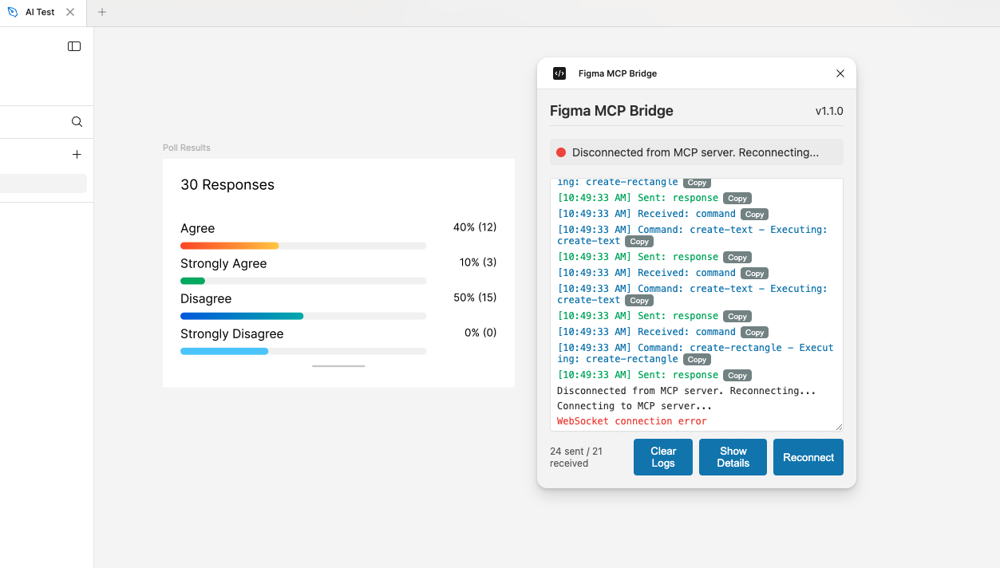

# Figma MCP Server Usage Guide

This guide explains how to use the Figma MCP server with Claude AI. The server provides two modes of operation: readonly mode and write mode.

## Overview

The Figma MCP server allows Claude AI to:

1. **Readonly Mode**: Extract design information from Figma files using a URL link
2. **Write Mode**: Create or update designs by establishing a connection with the Figma plugin

## Prerequisites

- A Figma account and access token
- The Figma MCP plugin installed in the Figma desktop app (for write mode)

## Configuration

The server requires a Figma access token to be set in the environment:

```bash
export FIGMA_ACCESS_TOKEN=your_figma_access_token
```

## Readonly Mode (Default)

In readonly mode, you can extract design information from a Figma file using a URL link. This is the default mode when the server starts.

### Example Usage

```typescript
// Get file information
const fileInfo = await use_mcp_tool({
  server_name: "figma-server",
  tool_name: "get_file_info",
  arguments: {
    figmaUrl: "https://www.figma.com/file/..."
  }
});

// Extract styles
const styles = await use_mcp_tool({
  server_name: "figma-server",
  tool_name: "extract_styles",
  arguments: {
    figmaUrl: "https://www.figma.com/file/..."
  }
});

// Get node details
const nodeDetails = await use_mcp_tool({
  server_name: "figma-server",
  tool_name: "get_node_details",
  arguments: {
    figmaUrl: "https://www.figma.com/file/...",
    nodeId: "123:456", // Optional if URL contains node-id
    detailLevel: "basic" // "summary", "basic", or "full"
  }
});

// Identify UI components
const components = await use_mcp_tool({
  server_name: "figma-server",
  tool_name: "identify_components",
  arguments: {
    figmaUrl: "https://www.figma.com/file/..."
  }
});
```

## Write Mode

In write mode, you can create or update designs by establishing a connection with the Figma plugin. This requires the user to have the Figma MCP plugin installed and running in the Figma desktop app.

### Switching to Write Mode

To switch to write mode, use the `switch_to_write_mode` tool:

```typescript
await use_mcp_tool({
  server_name: "figma-server",
  tool_name: "switch_to_write_mode",
  arguments: {
    prompt: "Please open the Figma desktop app and run the Figma MCP plugin" // Optional custom prompt
  }
});
```

### Creating Designs

Once in write mode, you can create designs using the following tools:

```typescript
// Create a frame
const frameId = await use_mcp_tool({
  server_name: "figma-server",
  tool_name: "create_frame",
  arguments: {
    parentNodeId: "123:456", // ID of the parent node
    name: "My Frame",
    x: 0,
    y: 0,
    width: 400,
    height: 300
  }
});

// Create a shape
const shapeId = await use_mcp_tool({
  server_name: "figma-server",
  tool_name: "create_shape",
  arguments: {
    parentNodeId: frameId.content[0].text.match(/ID (\S+)/)[1], // Extract ID from response
    type: "rectangle", // "rectangle", "ellipse", or "polygon"
    name: "My Rectangle",
    x: 50,
    y: 50,
    width: 100,
    height: 100,
    fill: {
      type: "SOLID",
      color: { r: 1, g: 0, b: 0, a: 1 } // Red color
    },
    cornerRadius: 8 // Optional for rectangles
  }
});

// Create text
const textId = await use_mcp_tool({
  server_name: "figma-server",
  tool_name: "create_text",
  arguments: {
    parentNodeId: frameId.content[0].text.match(/ID (\S+)/)[1], // Extract ID from response
    name: "My Text",
    x: 50,
    y: 200,
    width: 200,
    height: 50,
    characters: "Hello, Figma!",
    style: {
      fontFamily: "Inter",
      fontSize: 24,
      fontWeight: 700
    }
  }
});
```

### Modifying Designs

You can also modify existing designs:

```typescript
// Update node properties
await use_mcp_tool({
  server_name: "figma-server",
  tool_name: "update_node",
  arguments: {
    nodeId: textId.content[0].text.match(/ID (\S+)/)[1], // Extract ID from response
    properties: {
      x: 100,
      y: 150,
      characters: "Updated text!"
    }
  }
});

// Set fill
await use_mcp_tool({
  server_name: "figma-server",
  tool_name: "set_fill",
  arguments: {
    nodeId: shapeId.content[0].text.match(/ID (\S+)/)[1], // Extract ID from response
    fill: {
      type: "SOLID",
      color: { r: 0, g: 0, b: 1, a: 1 } // Blue color
    }
  }
});

// Delete node
await use_mcp_tool({
  server_name: "figma-server",
  tool_name: "delete_node",
  arguments: {
    nodeId: textId.content[0].text.match(/ID (\S+)/)[1] // Extract ID from response
  }
});
```
## Installing the plugin
- Open the figma desktop app
- Open the file in which you want to work
- Right click -> Plugins -> Development -> Import plugin from manifest -> select the manifest.json file from /plugin
- Start the plugin by right click -> Development -> Figma MCP Bridge
- Ask Claude to switch to write mode so that it connect to the Figma MCP Bridge

View of the plugin working and connected to Claude -



## Available Tools

### Readonly Mode Tools

- `validate_token`: Test if the configured token has access to a Figma file
- `get_file_info`: Get basic metadata about a Figma file
- `get_node_details`: Get detailed information about a specific node
- `extract_styles`: Extract color, text, and effect styles from a Figma file
- `get_assets`: Get image URLs for nodes in a Figma file
- `get_variables`: Get variables and variable collections from a Figma file
- `identify_components`: Identify UI components in a Figma design
- `detect_variants`: Detect component variants and group them
- `detect_responsive`: Detect responsive variations of components

### Write Mode Tools

- `switch_to_write_mode`: Switch to write mode to create or update designs
- `create_frame`: Create a new frame/artboard
- `create_shape`: Create a new shape (rectangle, ellipse, polygon)
- `create_text`: Create a new text element
- `create_component`: Create a new component
- `create_component_instance`: Create an instance of a component
- `update_node`: Update properties of an existing node
- `delete_node`: Delete a node
- `set_fill`: Set the fill properties of a node
- `set_stroke`: Set the stroke properties of a node
- `set_effects`: Set effects (shadows, blurs) on a node
- `smart_create_element`: Create an element using existing components when available
- `list_available_components`: List all available components in a file grouped by type

## Best Practices for Claude AI

When using the Figma MCP server with Claude AI, follow these best practices:

1. **Start in Readonly Mode**: Begin by exploring the design in readonly mode to understand its structure.

2. **Provide Clear Instructions**: When switching to write mode, provide clear instructions to the user about opening the Figma desktop app and running the plugin.

3. **Handle IDs Carefully**: Store and reference node IDs returned from creation operations for later use.

4. **Error Handling**: Handle errors gracefully, especially when the plugin is not connected or the user doesn't have the necessary permissions.

5. **Mode Awareness**: Be aware of which mode the server is in and use the appropriate tools.

6. **Provide Context**: When creating designs, explain what you're doing and why to help the user understand your design decisions.

## Example Workflow

Here's an example workflow for Claude AI:

1. Ask the user for a Figma file URL to analyze
2. Use readonly mode tools to extract design information
3. Discuss the design with the user
4. If the user wants to make changes, ask them to open the Figma desktop app and run the plugin
5. Switch to write mode
6. Make the requested changes
7. Switch back to readonly mode to verify the changes

## Troubleshooting

- **Plugin Not Connected**: If the plugin is not connected, ask the user to check if the Figma MCP plugin is running in the Figma desktop app.
- **Access Token Issues**: If you encounter access token errors, ask the user to check if their token has the necessary permissions.
- **Node Not Found**: If a node is not found, verify that the node ID is correct and that the user has access to the file.